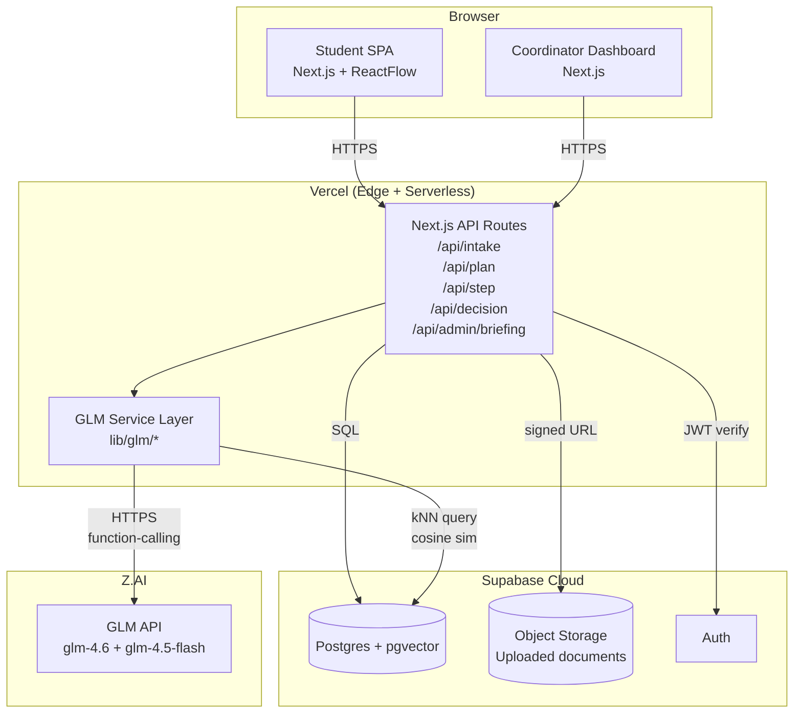
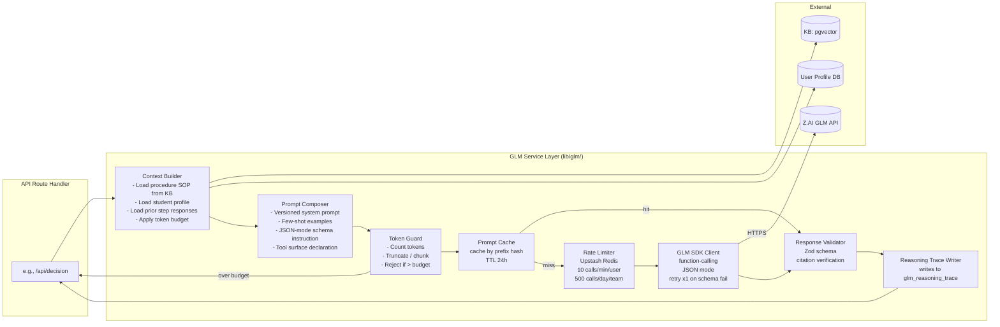
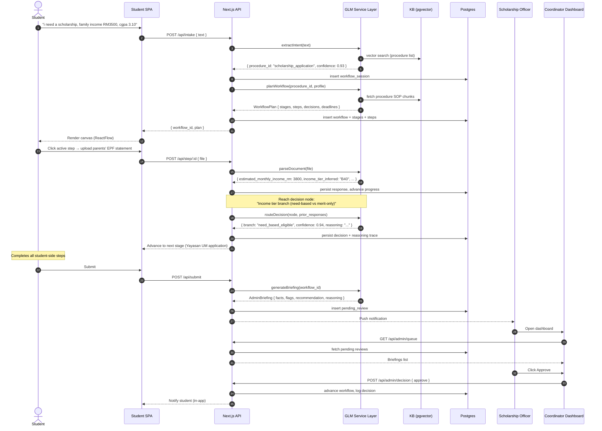
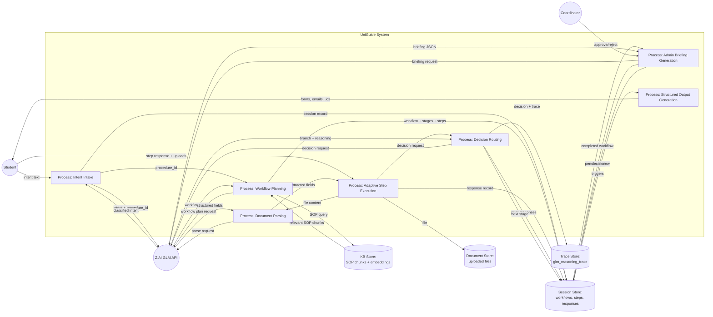
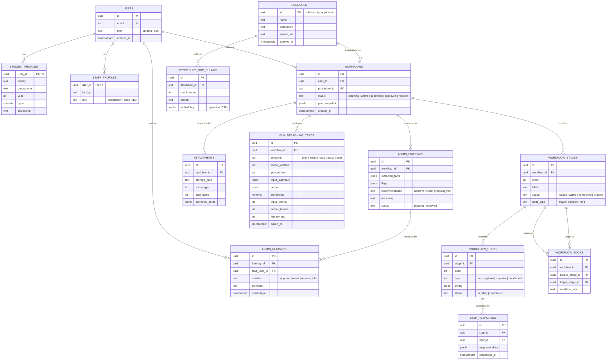

# SYSTEM ANALYSIS DOCUMENTATION (SAD)

**Project:** UniGuide
**Domain:** AI Systems & Agentic Workflow Automation (Domain 1)
**Team:** Breaking Bank
**Submission:** UMHackathon 2026 — Preliminary Round
**Date:** 18 April 2026
**Companion document:** [PRD.md](PRD.md)

---

## Introduction

### Purpose
This System Analysis Documentation (SAD) describes the technical scope, architectural decisions, data design, and operational strategy behind UniGuide — an AI-driven workflow assistant that guides Universiti Malaya students through complex multi-step administrative procedures using Z.AI's GLM as the central reasoning engine.

The document covers:
- **Architecture:** browser-based single-page application backed by serverless Next.js API routes, a Supabase Postgres database with `pgvector`, and Z.AI GLM as a service layer.
- **Data flows:** how a student's free-text intent moves through GLM-powered planning, adaptive step execution, and structured output generation.
- **Model process:** end-to-end workflow for the demonstrative Scholarship & Financial Aid Application procedure — from intake through coordinator approval.
- **Role of reference:** binding contract for the development team, reviewers, and judges to verify what is being built and why.

### Background
Universiti Malaya runs hundreds of administrative procedures across faculty, postgraduate, international-student, and examination domains. Today these procedures are documented in fragmented PDFs and word-of-mouth, with three separate student-facing portals (MAYA, SiswaMail, SPeCTRUM) that don't share a single procedural status surface. Students miss deadlines they didn't know existed; staff triage submissions that are missing the same fields week after week. The pain is universal across Malaysian public universities.

### Previous Version
None — this is a greenfield project built specifically for UMHackathon 2026.

### Changes in Major Architectural Components (vs. Conventional University Workflow Tools)
Conventional workflow tools require an administrator to **hand-design** a workflow template before users can execute it. Templates are static; branching logic is hard-coded in conditional rules; routing is regex over form fields. UniGuide inverts this:

| Conventional Tool | UniGuide |
|---|---|
| Admin hand-builds template upfront | **GLM plans the workflow at runtime** from indexed SOP documents |
| Routing = pre-coded edges + regex over form fields | **Routing = GLM reasons over actual response content** with confidence + reasoning trace |
| Steps = static forms shown to all users identically | **Steps adapt per user** — GLM rewrites questions, skips irrelevant fields, pre-fills from prior context |
| Failure = task stuck, manual escalation | **GLM proposes recovery actions** — chase email drafts, escalation suggestions, parallel sub-flows |

Removing the GLM service layer collapses UniGuide to a static form filler. There is **no fallback to a hard-coded workflow engine** — this is by deliberate design, in line with the hackathon brief that "if the GLM component is removed, the system should lose its ability to coordinate and execute the workflow effectively."

---

## Target Stakeholders

| Stakeholder | Role | Expectations |
|---|---|---|
| **Student (Undergraduate)** | Initiates a workflow for an administrative procedure (scholarship application, exam appeal, deferment, etc.). Provides intent, answers questions, uploads documents. | Be told clearly what to do next, in their context. Never miss a hidden deadline. Receive ready-to-use artefacts (filled forms, draft emails, calendar). |
| **Student (Postgraduate)** | Same as above, plus research-mode supervisor matching, candidature defence scheduling. | Lower hand-holding for technical content; same hand-holding for procedural compliance. |
| **Student (International)** | Same as above, plus EMGS visa renewal, MoE attendance/CGPA compliance. | Cross-procedure deadline awareness (don't let visa lapse during thesis defence). |
| **Yayasan UM Scholarship Officer** | Reviews student scholarship applications. | Receive a GLM-prepared briefing per submission with extracted facts (income tier inferred from EPF/payslip, CGPA shortfall + hardship justification surfaced, Bumiputera status confirmed), flagged edge cases, recommended decision + reasoning. Approve clear B40 cases in seconds. |
| **Faculty Postgraduate Committee Member** | Reviews postgraduate admission applications. | Same as above for admissions. |
| **Faculty Dean / Deputy Dean** | Escalation tier. | See escalated cases with full reasoning trace; audit consistency across coordinators. |
| **Development Team** | Build and maintain UniGuide. | Clear module boundaries, well-documented GLM integration, reproducible local setup, schema migrations under version control. |
| **QA Reviewer** | Validate system behaviour across roles and edge cases. | Documented test cases, deterministic test fixtures for GLM responses, AI output acceptance criteria. |

---

## System Architecture & Design

### High Level Architecture Overview

| Type | Details |
|---|---|
| **System** | Web application (responsive, browser-based) |
| **Architecture** | Single-page Next.js app + serverless API routes + Postgres with `pgvector` + Z.AI GLM as service layer |
| **Hosting** | Vercel (frontend + API routes), Supabase Cloud (Postgres + Storage + Auth) |
| **Topology** | UniGuide is a client-server-based system. Clients are: (1) Student SPA, (2) Coordinator Dashboard SPA. Both communicate via the Next.js API layer, which orchestrates Postgres reads/writes, Supabase Storage for file uploads, and external Z.AI GLM API calls. The API layer is stateless (serverless functions); all session and workflow state lives in Postgres. |

#### Component Diagram



### LLM as Service Layer

The GLM integration is **not** a generic "AI module" sprinkled across the codebase. It is encapsulated in a dedicated service layer (`lib/glm/`) with a strict contract:

- **Single entry point per use case** — `planWorkflow()`, `extractIntent()`, `adaptStep()`, `routeDecision()`, `parseDocument()`, `generateBriefing()`. No GLM calls outside this layer.
- **Deterministic input/output schemas** — every endpoint validates input with Zod, calls GLM with a versioned system prompt and JSON-mode output schema, and validates the response with Zod before returning.
- **Centralised retry, caching, and rate limiting** — Upstash Redis token-bucket limiter and prompt-prefix caching live in this layer.
- **Centralised reasoning-trace persistence** — every call writes a row to `glm_reasoning_trace` with the model version, prompt hash, response, latency, token counts, and any tool calls.

#### Dependency Diagram (GLM Service Layer Internals)



**What goes into the context window** (per call type):

| Endpoint | System prompt | User prompt content | Max tokens |
|---|---|---|---|
| `extractIntent` | Role: classifier. Output: `{procedure_id, confidence, clarifying_questions[]}` | Raw user text + list of available procedure IDs | 2,000 in / 200 out |
| `planWorkflow` | Role: planner. Few-shot: 3 reference workflows. Output schema: `WorkflowPlan` | Procedure SOP markdown + student profile JSON + intent | 16,000 in / 2,000 out |
| `adaptStep` | Role: tutor. Tone guidelines. Output: `{question_text, expected_response_type, context_hint}` | Step definition + prior responses + student profile | 4,000 in / 500 out |
| `routeDecision` | Role: judge. Chain-of-thought + JSON output | Decision-node config + relevant prior responses + uploaded doc text | 8,000 in / 1,000 out |
| `parseDocument` | Role: extractor. Schema-bound output | Document text (PDF-extracted or OCR'd) + extraction schema | 16,000 in / 2,000 out |
| `generateBriefing` | Role: admin assistant. Few-shot briefings. Output: `AdminBriefing` | All workflow responses + reasoning traces + procedure SOP excerpt | 12,000 in / 1,500 out |

**Token-limit enforcement:** the `TokenGuard` step counts tokens before the call. Procedure SOPs are pre-chunked at index time into sections ≤4,000 tokens. If the assembled context exceeds the budget for an endpoint, `TokenGuard` (a) attempts to drop oldest conversation turns from the running summary, (b) drops less-relevant SOP chunks (lowest cosine similarity first), (c) if still over budget, returns a structured error and the API surfaces "input too large; please simplify."

**Response parsing:**
1. GLM SDK returns raw text (JSON mode forces valid JSON syntactically).
2. `ResponseValidator` runs Zod parse against the per-endpoint schema.
3. On schema violation, **one** retry with a corrective system prompt addendum: *"Your previous response failed schema validation with error: [error]. Return only valid JSON matching the schema."*
4. On second failure, return structured error to the API handler, which surfaces a graceful error state to the user.
5. Citations (regulation references) are cross-checked against the KB; any citation not found in the KB is stripped from the user-facing response and logged as a hallucination event.

**Tool surface (function-calling):**
- `lookup_procedure(name: string)` → procedure metadata
- `get_student_profile()` → faculty, programme, year, CGPA, citizenship
- `parse_document(file_id: string)` → structured fields
- `lookup_regulation(reference: string)` → regulation text + source URL
- `add_calendar_event(title, due_date, description)` → adds to deadline calendar
- `draft_email(to_role, context)` → generates email draft
- `generate_form(template_id, field_data)` → fills PDF template

### Sequence Diagram — Scholarship Application (Happy Path)



### Sequence Diagram — Decision Node with Low Confidence (Adaptive Re-prompt)

```mermaid
sequenceDiagram
    actor Student
    participant SPA
    participant API
    participant GLM

    Note over API,GLM: Reach decision node;<br/>student response is ambiguous
    API->>GLM: routeDecision(node, responses)
    GLM-->>API: { branch: "blocked", confidence: 0.55, reasoning: "ambiguous" }
    Note over API: confidence &lt; 0.7 threshold
    API->>GLM: adaptStep(disambiguation_prompt)
    GLM-->>API: { question_text: "Your declared income RM 9,200 is borderline between M40 and T20. Could you confirm — is this gross or net monthly?" }
    API-->>SPA: Show disambiguation question
    Student->>SPA: Clarifies
    SPA->>API: POST /api/step/:id
    API->>GLM: routeDecision(node, updated_responses)
    GLM-->>API: { branch: "proceed", confidence: 0.91 }
    API-->>SPA: Advance
```

### Technological Stack

| Layer | Technology | Rationale |
|---|---|---|
| Frontend Framework | Next.js 15 (App Router, React 19) | SSR + serverless API routes in one deployment; aligned with Vercel hosting |
| UI Library | Tailwind CSS 4 + shadcn/ui patterns | Fast styling; no design-system maintenance burden |
| Workflow Canvas | ReactFlow v11 | Mature graph-rendering library; supports custom node types and edges |
| State Management | TanStack Query v5 | Server-state sync, optimistic mutations, cache invalidation |
| Validation | Zod v4 | Single schema for runtime validation + TypeScript inference |
| Backend (API) | Next.js API Routes (serverless) on Vercel | Stateless functions; easy GLM SDK integration |
| Database | Supabase Postgres (managed) + `pgvector` extension | Single managed service for relational data + vector retrieval |
| File Storage | Supabase Storage with signed URLs | Magic-byte validation; tenant-scoped buckets |
| Auth | Supabase Auth (email + magic link for MVP) | Stub auth fast; production-ready when needed |
| LLM | **Z.AI GLM API** — `glm-4.6` (planner, decision router, briefing) + `glm-4.5-flash` (intent, step adapter) | **Mandatory by hackathon rules.** Tool-calling, JSON mode, long context, prompt caching. |
| Document Parsing | `pdf-parse` (PDF) + `tesseract.js` (OCR fallback) | Lightweight, no external service dependency |
| Rate Limiting / Cache | Upstash Redis | Serverless-native; token-bucket limiter + prompt-prefix cache |
| Monitoring / Errors | Sentry (errors) + Vercel Analytics + custom metrics table | Free tier sufficient for hackathon; production-ready |
| CI/CD | GitHub Actions → Vercel preview deployments per PR | Zero-config preview URLs for demo dry-runs |

---

## Key Data Flows

### Data Flow Diagram (DFD — Level 1)



### Normalized Database Schema (3NF — ERD)



**3NF justifications:**
- `STUDENT_PROFILES` and `STAFF_PROFILES` are split from `USERS` to avoid nullable role-specific columns and to allow per-role indexes.
- `WORKFLOW_EDGES` is its own table (M:N would be wrong; it's 1:M from each stage but the relationship metadata — condition_key — belongs on the edge, not on the stage).
- `STEP_RESPONSES` is separate from `WORKFLOW_STEPS` because a step's *definition* is a different lifecycle entity than its *response* (response can be re-submitted; definition is immutable for the workflow's lifetime).
- `GLM_REASONING_TRACE` is append-only and indexed by `workflow_id, called_at` for per-workflow audit queries.
- `ADMIN_DECISIONS` is separate from `ADMIN_BRIEFINGS` so a single briefing can have a decision history (e.g., request_info → approve).

---

## Functional Requirements & Scope

### Minimum Viable Product (MVP)

| # | Feature | Description |
|---|---|---|
| 1 | **Conversational Intent Intake + GLM Workflow Planner** | Student types intent in plain English; GLM extracts the procedure, asks clarifying questions if confidence is low, and emits a structured workflow plan rendered on a ReactFlow canvas. |
| 2 | **Adaptive Step Engine with Document Parsing** | Each step's question is rewritten by GLM for the student's specific context. Document uploads (PDF/image) are parsed via GLM into structured fields and pre-fill subsequent steps. |
| 3 | **AI-Reasoned Decision Routing** | At every decision node, GLM evaluates the student's responses and chooses the next branch with a confidence score and natural-language reasoning. Below-threshold confidence triggers a clarifying question. |
| 4 | **Coordinator Briefing Dashboard** | Each completed submission is presented to the coordinator as a GLM-generated briefing — extracted facts, flagged edge cases, recommended decision with reasoning trace. One-click Approve / Reject / Request More Info. |
| 5 | **Structured Output Bundle** | At workflow completion, the system generates: (a) the official PDF form filled with collected data, (b) draft emails to the relevant offices, (c) `.ics` calendar with all deadlines, (d) a remaining-actions checklist. |

### Non-Functional Requirements (NFRs)

| Quality | Requirement | Implementation |
|---|---|---|
| **Scalability** | System must handle 50 concurrent active workflows in MVP; designed to scale to 500 in production with horizontal API scaling and Postgres read replicas. | Vercel serverless auto-scales API routes. Supabase Pro tier supports 500+ concurrent connections via connection pooling (PgBouncer). |
| **Reliability** | GLM endpoint failures must not lose workflow state. p95 successful workflow completion ≥ 95%. | All step responses persisted to Postgres before any GLM call. GLM-call retry once on schema-violation; on second failure, persist the failure event and surface user-facing error. Workflow can be resumed from any persisted step. |
| **Maintainability** | All GLM calls go through a single service layer (`lib/glm/`); no inline GLM SDK calls in API routes or components. Each endpoint has a versioned system prompt under source control. | Lint rule rejects direct `@anthropic`-style SDK imports outside `lib/glm/`. System prompts stored as `.md` files in `lib/glm/prompts/`, hashed and versioned per release. |
| **Token Latency** | GLM call p95 latency must be < 4s for planner / decision-router endpoints, < 1.5s for step-adapter. End-to-end "intent submitted → canvas rendered" p95 < 6s. | Use `glm-4.5-flash` for high-volume low-stakes calls. Stream UI affordances ("planning your workflow…") while planner runs. Async-with-timeout pattern (10s hard timeout, retry once). |
| **Cost Efficiency** | Average token cost per completed workflow must not exceed RM 0.50 (estimated 60,000 tokens). | (a) Prompt-prefix caching for SOPs and few-shot examples (target ≥ 60% cache hit rate). (b) Model tiering — flash for cheap calls, full glm-4.6 only for planning/routing. (c) Conversation summarisation: turns older than 20 collapsed to ≤500-token rolling summary. (d) Per-team daily quota (500 calls) with circuit breaker. |
| **Security** | No service-role keys in client bundle. All API routes verify Supabase Auth JWT. File uploads validated for magic bytes (not just MIME header). RLS enforced on every table. | API routes call `supabase.auth.getUser()` from the cookie; no anon-key client writes to user data. `validateMagicBytes()` helper before storing uploads. RLS policies in migrations under version control. |
| **Auditability** | Every GLM decision is logged with model version, prompt hash, response, and latency. Every coordinator decision is logged with timestamp and actor. | `glm_reasoning_trace` and `admin_decisions` tables append-only. `created_at` defaults to `now()`. No `DELETE` permissions in RLS policies. |
| **Hallucination Mitigation** | No regulation citation surfaced to the user unless verified to exist in the indexed KB. | `ResponseValidator` cross-checks every citation against `procedures.id` and `procedure_sop_chunks` table; unverified citations stripped and logged as hallucination event. |

### Out of Scope / Future Enhancements

- Real integration with MAYA / SiswaMail / SPeCTRUM / EMGS APIs (mocked for MVP).
- Email sending via SMTP (drafts generated; user copies and sends manually).
- Payment processing for exam appeal fees, EMGS fees.
- Native mobile apps (iOS/Android).
- Voice input.
- Bahasa Melayu UI (procedures may include BM document names; UI is English).
- Multi-user real-time collaboration on a single workflow.
- Per-faculty admin configuration UI (faculty rules are baked into the KB at index time for MVP).
- Postgrad-research candidature defence scheduling integration.
- Convocation-registration procedure.
- Hostel / accommodation procedure.
- Human-template-builder UI (not needed — GLM plans at runtime).

---

## Monitor, Evaluation, Assumptions & Dependencies

### Technical Evaluation

#### Grayscale Rollout & A/B Testing
- **Pre-launch (hackathon):** all features behind a single flag; deployed only to the team's own demo accounts and the 5 mock student accounts seeded in the database.
- **Post-launch (production roadmap):** 5% rollout via the UM HEPA scholarship office, monitor planner-success rate and officer approval-time delta. Expand to 25%, then 100%, gating each step on AI Output Pass Rate ≥ 80% and zero P0/P1 bugs.
- **A/B testing:** test two prompting strategies for the decision router (chain-of-thought vs. structured-only) on a 50/50 split, measuring confidence-calibration accuracy.

#### Emergency Rollback (ER) & Golden Release
- **Golden Release:** every passing CI run on `main` is tagged and saved to a Vercel deployment URL. Last known good deployment is documented in `docs/RELEASES.md`.
- **Trigger conditions for ER:**
  - GLM call success rate < 90% over a 5-minute window
  - p95 end-to-end latency > 15 seconds for 3 consecutive minutes
  - Hallucination event rate > 1% of decision-router calls
  - Any unhandled 5xx rate > 2%
- **Rollback action:** Vercel `promote --to <golden-url>`, automated via GitHub Action on alert webhook from Sentry.

#### Priority Matrix

| Priority | Definition | Example | Action |
|---|---|---|---|
| **P0 — Critical** | Service-down, data loss, or security breach | GLM service layer leaking student data into reasoning trace; auth bypass | Page on-call immediately; emergency rollback to Golden Release; postmortem within 24h |
| **P1 — High** | Core feature broken for all users | Planner returns invalid JSON for all procedures; canvas blank for all workflows | Hotfix within 4h; rollback if no fix in 4h |
| **P2 — Medium** | Single-procedure or single-edge-case failure | Decision router mis-routes 10% of borderline M40-vs-T20 income-tier cases | Fix within 2 days; mitigate with confidence threshold tweak |
| **P3 — Low** | Cosmetic, single-user, or rare edge case | Toast styling broken on Safari < 16; one user reports a typo | Backlog; fix in next sprint |

#### Monitoring
- **Health checks:** `/api/health` returns 200 if Postgres is reachable and GLM API responds to a canary prompt within 5s.
- **Sentry:** all unhandled errors, including GLM schema-violation events, captured with workflow_id and user_id breadcrumbs.
- **Custom metrics table** (`metrics_glm_calls`): per-call duration, token counts, cache hit/miss, retry count. Aggregated nightly.
- **Alerts (post-MVP):** PagerDuty integration with thresholds on success rate, latency p95, hallucination rate.

### Assumptions
- **A1.** Students have a stable internet connection during workflow sessions (poor connectivity will time out GLM calls; we surface a "retry" affordance).
- **A2.** Coordinators have desktop access for the briefing dashboard (mobile-responsive but not optimised for phone).
- **A3.** UM SOPs change infrequently enough that a quarterly KB re-index is sufficient.
- **A4.** Z.AI GLM API uptime is ≥ 99.5% and rate limits accommodate a hackathon-scale demo (~500 calls/day).
- **A5.** Document uploads are predominantly machine-readable PDFs; OCR is fallback only.
- **A6.** Mock student profiles seeded in the database are sufficient for the demo; real MAYA integration is a separate production track.

### External Dependencies

| Tool / Service | Purpose | Risk | Mitigation |
|---|---|---|---|
| **Z.AI GLM API** | Core reasoning engine — planning, decision routing, document parsing, briefing generation | **Critical**: GLM API outage or rate-limit breach kills the core product (by design — see "no fallback" architectural decision). | Per-team daily quota (500 calls), per-user rate limit (10/min), prompt caching, pre-recorded demo backup video for live presentation, Sentry alert on call-success rate < 90%. |
| **Supabase Postgres + pgvector** | Application database, KB vector store, file storage, auth | High: complete outage takes the system down. | Supabase Cloud SLA (99.9%); local Postgres dev fallback for development. |
| **Vercel** | Hosting (frontend + API routes) | Medium: outage takes the deployed app down but does not affect data. | Standard Vercel SLA; Golden Release tag for fast redeploy on alternate region if needed. |
| **Upstash Redis** | Rate limiter + prompt-prefix cache | Low: failure degrades to direct GLM calls without caching (slower, more expensive, but functional). | Circuit breaker; cache layer treated as best-effort. |
| **Sentry** | Error tracking | Low: monitoring blind-spot, no user impact. | — |
| **GitHub** | Version control + CI/CD | Low: development blocked, no production impact. | — |
| **`pdf-parse` + `tesseract.js` (npm packages)** | Document parsing | Low: bundled with the application. | Pin versions; test fixtures for both. |

---

## Project Management & Team Contributions

### Project Timeline (10-day Preliminary Sprint)

| Day | Date | Milestone |
|---|---|---|
| 1 | Wed 16 Apr | Domain selection received; problem statement reviewed |
| 2 | Thu 17 Apr | Initial brainstorming, vertical decision (university admin) |
| 3 | Fri 18 Apr | Research UM procedures (6 procedures documented); FlowNote reference architecture studied; PRD + SAD drafted |
| 4 | Sat 19 Apr | QATD draft; pitch deck content; code skeleton scaffolded; Z.AI API key acquired |
| 5 | Sun 20 Apr | KB seeding (SOP indexing); GLM service layer built (planner, intent, decision router) |
| 6 | Mon 21 Apr | Adaptive step engine, document parsing, ReactFlow canvas integration |
| 7 | Tue 22 Apr | Coordinator dashboard, structured output generation, end-to-end Scholarship Application flow |
| 8 | Wed 23 Apr | Postgrad Admission flow (secondary procedure); UI polish; test cases written |
| 9 | Thu 24 Apr | QA pass, AI output testing, hallucination mitigation hardening |
| 10 | Fri 25 Apr | Pitch deck finalised, video recording, deployment to production URL, dry-run |
| Submit | Sat 26 Apr 07:59 | **Final submission** |

### Team Members & Roles

| Member | Role | Responsibilities |
|---|---|---|
| **Jeanette Tan En Jie** | Group Leader | Coordination, mentorship session, submission ownership, stakeholder communication |
| **Teo Zen Ben** | Technical Lead | Architecture, GLM service layer, workflow engine, schema, code review |
| **Nyow An Qi** | *role TBD* | *to be confirmed* |
| **Thevesh A/L Chandran** | *role TBD* | *to be confirmed* |

Suggested role splits for the remaining two members (subject to team confirmation):
- **Frontend / UX** — Student SPA, ReactFlow canvas styling, step renderers, coordinator dashboard
- **QA / Pitch** — Test cases, AI output validation, pitch deck, video recording, deployment dry-runs

### Recommendations

- **Use GLM prompt caching aggressively.** Procedure SOPs and few-shot examples are static and account for ~70% of input tokens. Cache hit rate ≥ 60% is the difference between "fits in budget" and "blows the budget."
- **Pre-record the demo.** Even with retries, GLM API has tail latency. A 90-second pre-recorded video as backup means the live demo can fail gracefully without losing presentation time.
- **Seed mock data realistically.** Use real UM faculty names, real scholarship names (Yayasan UM, MARA, JPA, MyBrainSc, Khazanah), real income brackets (DOSM B40 < RM 4,850), real regulation references (Reg.40, Reg.42). Judges will recognise the authenticity.
- **Defer multi-tenant.** Tempting to over-engineer. For MVP, single-workspace + role-based access is sufficient and ships faster.
- **Hard-code the second procedure's KB snippets** if time runs short on Postgrad Admission. The point is to *demonstrate* the engine generalises; full coverage is a stretch goal.

---

**End of SAD v1.0**
