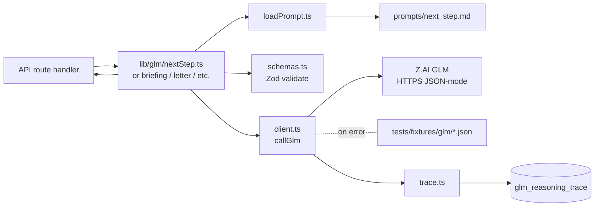
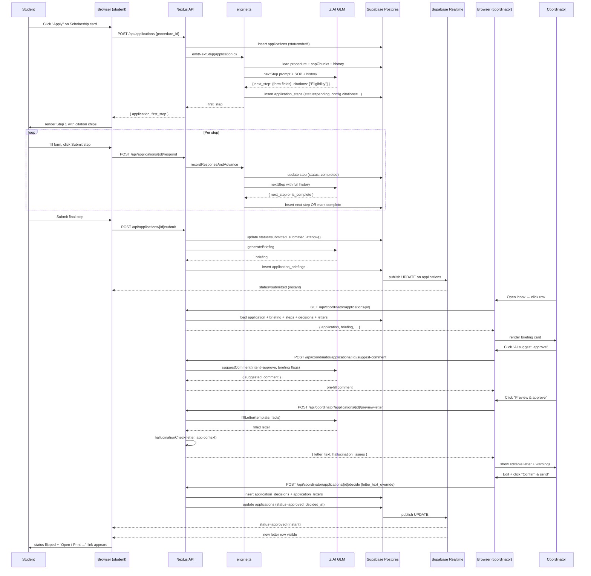
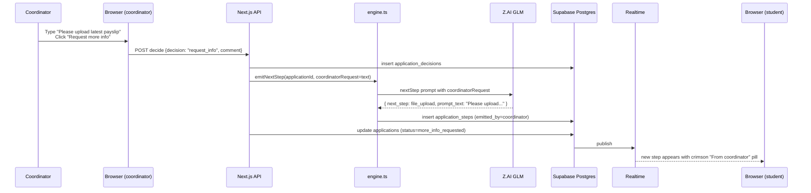
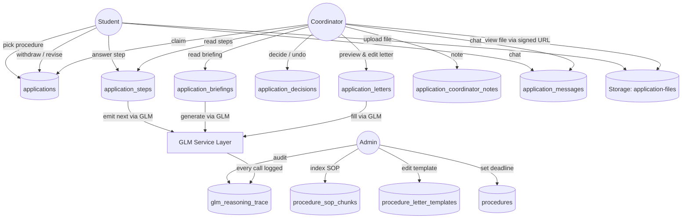

# SYSTEM ANALYSIS DOCUMENTATION (SAD)

**Project:** UniGuide
**Version:** 2.0 (sync with shipped state 2026-04-20)
**Domain:** AI Systems & Agentic Workflow Automation (Domain 1)
**Team:** Breaking Bank
**Submission:** UMHackathon 2026 — Preliminary Round
**Companion document:** [PRD.md](PRD.md)
**Live deployment:** https://uniguide-blush.vercel.app

---

## Introduction

### Purpose
This System Analysis Documentation (SAD) describes the technical scope, architectural decisions, data design, and operational strategy behind UniGuide — an AI-driven workflow assistant that guides Universiti Malaya students through complex multi-step administrative procedures using Z.AI's GLM as the central reasoning engine.

The document covers:
- **Architecture:** browser-based three-role app backed by serverless Next.js 15 App Router APIs, a Supabase Postgres database with `pgvector`, Supabase Storage for file uploads, Supabase Realtime for instant client updates, and Z.AI GLM as a versioned-prompt service layer.
- **Data flows:** how a student's procedure choice moves through GLM-powered turn-by-turn step emission, document upload + retrieval, coordinator briefing, and letter generation with hallucination check.
- **Model process:** end-to-end workflow for the demonstrative Scholarship & Financial Aid Application procedure — from intake through coordinator approval, including the realtime-update path back to the student.
- **Role of reference:** binding contract for the development team, reviewers, and judges to verify what is being built and why.

### Background
Universiti Malaya runs hundreds of administrative procedures across faculty, postgraduate, international-student, and examination domains. Today these procedures are documented in fragmented PDFs and word-of-mouth, with three separate student-facing portals (MAYA, SiswaMail, SPeCTRUM) that don't share a single procedural status surface. Students miss deadlines they didn't know existed; staff triage submissions that are missing the same fields week after week.

### Previous Version
None — this is a greenfield project built specifically for UMHackathon 2026.

### Changes in Major Architectural Components (vs. Conventional University Workflow Tools)
Conventional workflow tools require an administrator to **hand-design** a workflow template before users can execute it. Templates are static; branching logic is hard-coded; routing is regex over form fields. UniGuide inverts this:

| Conventional Tool | UniGuide |
|---|---|
| Admin hand-builds template upfront | **GLM emits the next step at runtime** from the indexed SOP + the student's complete history |
| Routing = pre-coded edges + regex over form fields | **There are no edges** — every step is a fresh `nextStep` GLM call that reads everything answered so far |
| Steps = static forms shown to all users identically | **Steps are emitted per-user per-turn** — type, prompt, config, citations all decided at runtime |
| Failure = task stuck, manual escalation | **GLM auto-fallback to fixtures** + 5-minute coordinator undo + step revise — multiple recovery paths |
| Coordinator decides on raw form | **Pre-digested briefing** + AI-suggest comment + previewable letter + hallucination check |

Removing the GLM service layer collapses UniGuide to nothing — there is no static workflow template to fall back on. This is by deliberate design, in line with the hackathon brief.

---

## Target Stakeholders

| Stakeholder | Role | What they get |
|---|---|---|
| **Student (Undergraduate)** | Initiates a workflow for an administrative procedure. | Adaptive turn-by-turn steps with citations, real file uploads to Supabase Storage, real-time status updates, profile editor, withdraw + revise, message thread with coordinator, source-SOP viewer. |
| **Student (Postgraduate)** | Same as undergraduate, plus research-mode supervisor matching. | Same surface; procedure-specific SOP indexes provide the variation. |
| **Student (International)** | Same plus EMGS visa renewal, MoE attendance compliance. | Same surface. |
| **Yayasan UM Scholarship Coordinator** | Reviews student scholarship applications. | Inbox sorted by AI urgency, plain-English confidence labels, AI briefing per submission, AI-suggest comment, preview-and-edit letters with hallucination check, undo within 5 min, internal notes (staff-only), realtime message thread with student. |
| **Faculty Postgraduate Committee Member** | Reviews postgraduate admission applications. | Same coordinator surface. |
| **Faculty Dean / Deputy Dean** | Escalation tier; admin-level access. | All coordinator features + analytics + GLM trace audit. |
| **Admin** | Indexes SOPs, edits letter templates, sets deadlines. | Procedures library, 3-step SOP upload modal (paste / URL / **PDF**), letter template editor with sensible defaults, deadline editor, analytics dashboard, GLM reasoning-trace viewer. |
| **Development Team** | Build and maintain UniGuide. | Versioned prompts in `lib/glm/prompts/*.md`, Zod-validated GLM I/O, 14 numbered Supabase migrations, Next.js App Router with strict TypeScript. |
| **QA Reviewer** | Validate system behaviour across roles and edge cases. | Test fixtures in `tests/fixtures/glm/`, mock-mode demo seed (5 sample applications via `/api/demo/reset`). |

---

## System Architecture & Design

### High Level Architecture Overview

| Type | Details |
|---|---|
| **System** | Web application (responsive on student-facing pages) |
| **Architecture** | Next.js 15 App Router (server + client components) + ~30 API route handlers + Postgres with `pgvector` + Supabase Storage + Supabase Realtime + Z.AI GLM as service layer |
| **Hosting** | Vercel (frontend + API routes), pinned to `sin1` (Singapore) for ~70ms RTT to Supabase. Supabase Cloud `ap-northeast-2` (Seoul). |
| **Topology** | Three role-distinct browser surfaces (Student / Coordinator / Admin) all served from a single Next.js deployment. Stateless API layer; all session state in Supabase Postgres. Realtime channels push status updates from Postgres → client without polling. |

#### Component Diagram

```mermaid
flowchart TB
    subgraph Browser
        StudentSPA[Student surfaces<br/>/student/portal<br/>/student/applications/[id]<br/>/settings/profile]
        CoordSPA[Coordinator surfaces<br/>/coordinator/inbox<br/>/coordinator/applications/[id]]
        AdminSPA[Admin surfaces<br/>/admin<br/>/admin/procedures/[id]<br/>/admin/analytics<br/>/admin/glm-traces]
    end

    subgraph "Vercel — sin1"
        API[Next.js API Routes ~30 endpoints]
        Engine[lib/applications/engine.ts<br/>recordResponseAndAdvance<br/>emitNextStep<br/>loadApplicationContext<br/>buildHistory]
        GLMClient[lib/glm/* service layer]
        AuthGuard[lib/auth/guards.ts<br/>requireUser, requireRole]
    end

    subgraph "Supabase — ap-northeast-2"
        DB[(Postgres + pgvector<br/>14 migrations)]
        Store[(Storage<br/>application-files bucket<br/>RLS-protected)]
        Auth[Auth<br/>OTP + demo passwords]
        Realtime[Realtime publication<br/>applications, application_steps,<br/>application_letters, application_messages]
    end

    subgraph "Z.AI"
        GLM[GLM API<br/>glm-4.6 + glm-4.5-flash]
    end

    StudentSPA -->|HTTPS| API
    CoordSPA -->|HTTPS| API
    AdminSPA -->|HTTPS| API
    StudentSPA <-->|WebSocket| Realtime
    CoordSPA <-->|WebSocket| Realtime
    StudentSPA -.signed URL.-> Store
    API -->|service role SQL| DB
    API --> Engine
    API --> AuthGuard
    Engine --> GLMClient
    GLMClient -->|HTTPS JSON-mode| GLM
    GLMClient -->|on error → fixture| GLMClient
    Realtime -.publish.- DB
```

### LLM as Service Layer

GLM is encapsulated in `lib/glm/`:

| File | Purpose |
|---|---|
| `client.ts` | The single `callGlm({model, systemPrompt, userPrompt, jsonMode, mockFixture, ...})` entry point. Handles real Z.AI calls + mock-mode + auto-fallback to fixtures on error. Never imported directly outside `lib/glm/`. |
| `schemas.ts` | Zod schemas for every GLM input + output. `NextStepInputSchema`, `NextStepOutputSchema`, `BriefingOutputSchema`, `FillLetterOutputSchema`, `EstimateProgressOutputSchema`, `FormFieldSchema` (with file field type), `StepConfigSchema`. |
| `nextStep.ts` | Calls `callGlm(model: glm-4.6)` to emit the next application step. Returns `{ is_complete, next_step?, reasoning, running_summary?, citations[] }`. |
| `generateBriefing.ts` | Calls `callGlm(model: glm-4.6)` to produce the coordinator briefing. Returns `{ extracted_facts, flags[], recommendation, reasoning, confidence }`. |
| `fillLetter.ts` | Calls `callGlm(model: glm-4.6, jsonMode: true)` to fill a `{{placeholder}}` template against application context. Returns `{ filled_text, unfilled_placeholders[] }`. |
| `estimateProgress.ts` | Calls `callGlm(model: glm-4.5-flash)` for total step count. |
| (suggestComment) | Inline system prompt in `/api/coordinator/applications/[id]/suggest-comment` route. Drafts coordinator-side comment based on briefing flags + decision intent. |
| `loadPrompt.ts` | Loads system-prompt `.md` files from `prompts/` so prompt content is versioned in source. |
| `trace.ts` | After every `callGlm`, writes a row to `glm_reasoning_trace` (model_version, prompt_hash, input_summary, output, latency_ms, input_tokens, output_tokens, confidence, cache_hit). |
| `prompts/*.md` | The actual system prompt for each endpoint, version-controlled and hash-loggable. |

Every endpoint's I/O is JSON-mode with strict Zod validation. Schema violation throws → caller returns 500. There is no free-text "freestyling" — GLM always speaks structured JSON to UniGuide.

#### Dependency Diagram (GLM Service Layer Internals)



### Sequence Diagram — Scholarship Application (Happy Path, Submit-to-Approve)



### Sequence Diagram — Coordinator Requests More Info (Loop)



### Technological Stack

| Layer | Choice | Why |
|---|---|---|
| Frontend framework | Next.js 15 App Router (React 19) | Server components for data-heavy admin pages; client components where realtime/interactivity needed. |
| Language | TypeScript (strict) | Schema-driven I/O via Zod; catches GLM contract drift at compile time. |
| Styling | Tailwind CSS 4 + custom design tokens | Custom palette (--ink navy, --crimson, --moss, --ai-tint lavender). Component-scoped classes (`ug-card`, `ug-btn`, `ug-input`, `ug-pill`). |
| Icons | Lucide React | Single icon system; replaced all emoji to keep the UI professional and accessible. |
| Auth | Supabase Auth (OTP email + demo password) | Cookie-based JWT via `@supabase/ssr`. Three demo accounts seeded for one-click sign-in. |
| Database | Supabase Postgres + `pgvector` | One managed service for relational + vector. All tables RLS-protected. |
| Storage | Supabase Storage (`application-files` bucket) | Private bucket. RLS: INSERT requires owner folder; SELECT requires owner OR staff/admin. Signed URLs (60s) via `/api/files/sign`. |
| Realtime | Supabase Realtime publication | `applications`, `application_steps`, `application_letters`, `application_messages` published. Client subscribes to filtered channels. |
| LLM | Z.AI GLM via OpenAI-compatible SDK | `glm-4.6` for reasoning; `glm-4.5-flash` for high-volume. JSON mode + system+user prompts + max_tokens. |
| PDF parsing | `pdf-parse` (server-side) | Marked as `serverExternalPackages` in `next.config.ts` to avoid webpack bundling its Node-only deps. |
| Hosting | Vercel (`sin1` region) | Pinned to Singapore for low latency to Supabase Seoul. |

---

## Key Data Flows

### Data Flow Diagram (DFD — Level 1)



### Normalized Database Schema (3NF — ERD)

**14 tables across 13 migrations:**

```
users (id PK, email UNIQUE, role CHECK in admin/student/staff, created_at)

student_profiles (user_id PK→users.id, full_name, faculty, programme,
    year CHECK 1-8, cgpa CHECK 0-4, citizenship default MY, matric_no UNIQUE)

staff_profiles (user_id PK→users.id, full_name, faculty,
    staff_role CHECK in admin/coordinator/dean/dvc/ips_officer)

procedures (id PK text, name, description, source_url, faculty_scope,
    indexed_at, deadline_date, deadline_label)

procedure_sop_chunks (id PK uuid, procedure_id→procedures.id, chunk_order,
    section, content, source_url, embedding vector(1536), indexed_at)

procedure_letter_templates (id PK uuid, procedure_id→procedures.id,
    template_type CHECK in acceptance/rejection/request_info/custom,
    name, template_text, detected_placeholders text[],
    created_by→users.id, created_at, updated_at,
    UNIQUE(procedure_id, template_type, name))

applications (id PK uuid, user_id→users.id, procedure_id→procedures.id,
    status CHECK in draft/submitted/under_review/more_info_requested/
        approved/rejected/withdrawn,
    progress_current_step, progress_estimated_total,
    student_summary, ai_recommendation, ai_confidence,
    assigned_to→auth.users(id), assigned_at,
    created_at, submitted_at, decided_at, updated_at)

application_steps (id PK uuid, application_id→applications.id, ordinal,
    type CHECK in form/file_upload/text/select/multiselect/info/
        final_submit/coordinator_message,
    prompt_text, config jsonb, emitted_by CHECK in ai/coordinator,
    emitted_by_user_id→users.id, status CHECK in pending/completed/skipped,
    response_data jsonb, created_at, completed_at)

application_briefings (id PK uuid, application_id→applications.id,
    extracted_facts jsonb, flags jsonb default '[]',
    recommendation CHECK, reasoning,
    status CHECK in pending/resolved, created_at)

application_decisions (id PK uuid, application_id→applications.id,
    briefing_id→application_briefings.id, decided_by→users.id,
    decision CHECK in approve/reject/request_info/withdrawn,
    comment, decided_at)

application_letters (id PK uuid, application_id→applications.id,
    template_id→procedure_letter_templates.id,
    letter_type CHECK, generated_text, pdf_storage_path,
    delivered_to_student_at, delivered_via_email default false, created_at)

application_coordinator_notes (id PK uuid,
    application_id→applications.id, author_id→auth.users(id),
    body CHECK length 1-4000, created_at, updated_at)
    [RLS: staff/admin read+insert, author delete-own]

application_messages (id PK uuid, application_id→applications.id,
    author_id→auth.users(id),
    author_role CHECK in student/coordinator,
    body CHECK length 1-4000, created_at)
    [RLS: owner+staff read; insert by role with author_role match]
    [Realtime publication: yes]

glm_reasoning_trace (id PK uuid, workflow_id, endpoint CHECK,
    model_version, prompt_hash, input_summary jsonb, output jsonb,
    confidence, citations text[], citation_verified default true,
    input_tokens, output_tokens, latency_ms, cache_hit default false,
    retry_count default 0, called_at)

attachments (legacy v1 table — superseded by Storage bucket + step.response_data)
```

**Storage:**
- `application-files` bucket (private, 10 MB limit, MIME-restricted to PDF/JPG/PNG/WEBP/DOC/DOCX)
- Path: `{user_id}/{application_id}/{step_id}-{timestamp}-{safeName}`
- RLS:
  - INSERT: `(storage.foldername(name))[1] = auth.uid()::text`
  - SELECT: same OR staff/admin
  - DELETE: owner only

**Realtime publication (`supabase_realtime`):** `applications`, `application_steps`, `application_letters`, `application_messages`.

### API Surface (~30 endpoints)

| Method | Path | Auth | Purpose |
|---|---|---|---|
| GET | `/api/procedures` | any user | List procedures for student portal |
| GET | `/api/procedures/[id]/sop` | any user | SOP chunks for the SOP viewer |
| GET, POST | `/api/applications` | student | List my apps / create new |
| GET | `/api/applications/[id]` | owner+staff | Full application |
| POST | `/api/applications/[id]/respond` | owner | Submit step response → emit next |
| POST | `/api/applications/[id]/submit` | owner | Final submit → trigger briefing |
| POST | `/api/applications/[id]/withdraw` | owner | Cancel an in-flight app |
| POST | `/api/applications/[id]/revise/[stepId]` | owner | Reset a completed step + delete later steps |
| GET, POST | `/api/applications/[id]/messages` | owner+staff | Message thread |
| GET | `/api/coordinator/inbox` | staff/admin | Inbox queue with briefings inlined |
| GET | `/api/coordinator/applications/[id]` | staff/admin | Detail view with briefing/steps/decisions/letters/assignee |
| POST | `/api/coordinator/applications/[id]/decide` | staff/admin | Approve / reject / request info, with optional `letter_text_override` |
| POST | `/api/coordinator/applications/[id]/preview-letter` | staff/admin | Generate letter without committing + run hallucination check |
| POST | `/api/coordinator/applications/[id]/suggest-comment` | staff/admin | AI-draft a coordinator comment |
| POST | `/api/coordinator/applications/[id]/undo` | staff/admin | Revert a decision within 5 min |
| POST, DELETE | `/api/coordinator/applications/[id]/claim` | staff/admin | Claim / release an application |
| GET, POST | `/api/coordinator/applications/[id]/notes` | staff/admin | Internal notes |
| DELETE | `/api/coordinator/applications/[id]/notes/[noteId]` | author | Delete own note |
| GET, POST | `/api/admin/procedures` | admin | List / create procedures |
| PATCH | `/api/admin/procedures/[id]` | admin | Update deadline, description, faculty_scope |
| POST | `/api/admin/procedures/[id]/sop` | admin | Upload SOP text → chunk + index |
| POST | `/api/admin/procedures/parse-pdf` | admin | Extract text from a PDF (`pdf-parse`) |
| GET, POST | `/api/admin/procedures/[id]/letter-templates` | admin | List / upsert templates |
| DELETE | `/api/admin/procedures/[id]/letter-templates/[templateId]` | admin | Delete template |
| GET | `/api/files/sign?path=…` | owner+staff | 60s signed URL for an uploaded file |
| GET | `/api/notifications` | any user | Last-14-days events feed for the bell |
| GET, POST | `/api/profile` | any user | Read / upsert profile |
| POST | `/api/profile/bootstrap` | any user | Returns whether onboarding needed |
| POST | `/api/demo/reset` | any user | Wipe + reseed demo student with 5 sample apps |

---

## Functional Requirements & Scope

### Minimum Viable Product (MVP)

**Live demo procedure: Scholarship & Financial Aid (Yayasan UM)** — implemented end-to-end.

All 28 functionalities (F1–F28 in PRD §4.2) are wired and demoable. The demo seeds 5 sample applications (mid-flow draft, high-conf approve, low-conf+flagged, approved, rejected) so coordinator inbox + analytics + GLM traces all populate immediately on `/api/demo/reset`.

Six procedures listed in the catalogue; only Scholarship is Live (others get "Coming soon" badges so the catalogue communicates scope without misleading).

### Non-Functional Requirements (NFRs)

| NFR | Target | How achieved |
|---|---|---|
| **Latency p95 — `nextStep`** | < 4s | Model: glm-4.6, JSON mode, max_tokens 2000. Vercel `sin1` ↔ Supabase Seoul ~70ms. |
| **Latency p95 — `suggestComment`** | < 1.5s | Model: glm-4.5-flash, max_tokens 400. |
| **Realtime push p95** | < 1s | Supabase Realtime publication; client-side subscription with filter. |
| **File upload p95** | < 3s for 5 MB | Direct browser-to-Storage via Supabase JS client; no Next.js relay. |
| **Auth p95** | < 500ms | Cookie-based JWT verified via `@supabase/ssr`. |
| **Security — file privacy** | Owner + staff only | Bucket RLS + signed URLs. Verified by demo cross-account test. |
| **Audit — every GLM call** | 100% | `trace.ts` writes `glm_reasoning_trace` for every `callGlm` invocation. Visible at `/admin/glm-traces`. |
| **Resilience — GLM outage** | Demo continues | Auto-fallback to fixtures with logged error; `model: …-fallback` marker in trace. |

### Out of Scope / Future Enhancements

- Email delivery via SMTP (currently in-app letter delivery)
- Server-side PDF generation (currently browser print)
- OCR for image-only PDFs
- Bahasa Melayu UI
- Voice intake
- Real MAYA / SiswaMail / EMGS API integrations
- Payment processing
- Multi-tenant isolation
- Native mobile apps
- Push notifications
- Coordinator-side bulk reject

---

## Monitor, Evaluation, Assumptions & Dependencies

### Technical Evaluation

#### Rollout Strategy
- **Mock mode default** (`GLM_MOCK_MODE=true`) on shared deploy + demo banner. Real Z.AI mode is one env var flip on Vercel (`GLM_MOCK_MODE=false` + valid `ZAI_API_KEY`).
- **Auto-fallback on real-mode error** — even after flipping to real, if a call errors, the fixture saves the demo. Logged loudly to `console.error` so production monitoring catches it.

#### Emergency Rollback
- Each round of features was committed + pushed independently (~12 commits across 7 rounds). Vercel keeps prior deployments — one-click rollback via dashboard.
- Database migrations are additive (no destructive ALTERs); rollback typically only needs Vercel rollback, not migration reversal.

#### Priority Matrix (what gets fixed first if demo breaks)

| Priority | Surface | Why |
|---|---|---|
| P0 | Student demo flow (`/login` → `/student/portal` → application → submit) | Core narrative for judges |
| P0 | Coordinator demo flow (`/login` → `/coordinator/inbox` → detail → preview & approve) | Other half of core narrative |
| P1 | `/admin/glm-traces` | Transparency story; judges may ask |
| P1 | Realtime updates | Wow factor; if broken, flag manually |
| P2 | Admin SOP upload | Less likely demoed live |

#### Monitoring
- Vercel deployment logs + runtime logs
- `glm_reasoning_trace` for every model call (latency, tokens, errors)
- Supabase dashboard for DB + Storage metrics
- `console.error` from auto-fallback path captured in Vercel logs

### Assumptions
- UM SOPs change infrequently enough that re-indexing once a semester is sufficient.
- Coordinators are willing to read briefings + edit GLM-drafted letters (vs. full automation, which we deliberately don't do).
- Students are willing to accept turn-by-turn step emission as a flow (vs. seeing the whole form upfront — we believe step-at-a-time reduces overwhelm).
- Z.AI GLM availability is sufficient for production scale; rate-limit + cost monitoring is in roadmap.

### External Dependencies
- **Z.AI GLM API** — mandatory per hackathon rules. Mock-mode + auto-fallback hedges against outages.
- **Supabase Cloud (Postgres + Storage + Auth + Realtime)** — managed hosting. Single-region (Seoul) for now.
- **Vercel** — Next.js hosting. Pinned to `sin1`.
- **`pdf-parse`** — server-only PDF text extraction. Marked `serverExternalPackages` in `next.config.ts`.

---

## Project Management & Team Contributions

### Project Timeline
- **Week 1 (Apr 14–18):** v1 architecture (workflow templates + ReactFlow canvas), 3 documents, initial Supabase schema, login + onboarding.
- **Week 2 (Apr 18–20):** v2 pivot to step-by-step AI emission. 14 migrations. 7 rounds of feature work covering all surfaces.
- **Apr 20:** Documents synced to actual shipped state (this revision).
- **Apr 20–25:** Demo polish, rehearsals, video record.
- **Sat Apr 26 07:59:** Hackathon submission deadline.

### Team Members & Roles
- **Jeanette Tan En Jie** — Frontend, design system, copy
- **Teo Zen Ben** — Backend, GLM integration, infrastructure (Vercel + Supabase)
- **Nyow An Qi** — Procedure research, SOP indexing, fixture authoring
- **Thevesh A/L Chandran** — Coordinator UX, briefing prompt engineering, demo seed

### Recommendations
- **For real production use:** wire SMTP for letter delivery; add OCR for scanned PDFs; harden bucket RLS with per-procedure scoping; cost-monitor GLM with daily quota alerts.
- **For other Malaysian universities:** the engine is procedure-agnostic — swap the SOP corpus + letter templates and the same UniGuide app guides USM / UKM / UPM / UTM students.
- **For other Malaysian government procedures:** SSM / LHDN / EPF / Halal cert all have the same shape — UniGuide's pattern (SOP → AI emits steps → coordinator decides) generalises.

---

**End of SAD v2.0 — synced with shipped state as of 2026-04-20**
